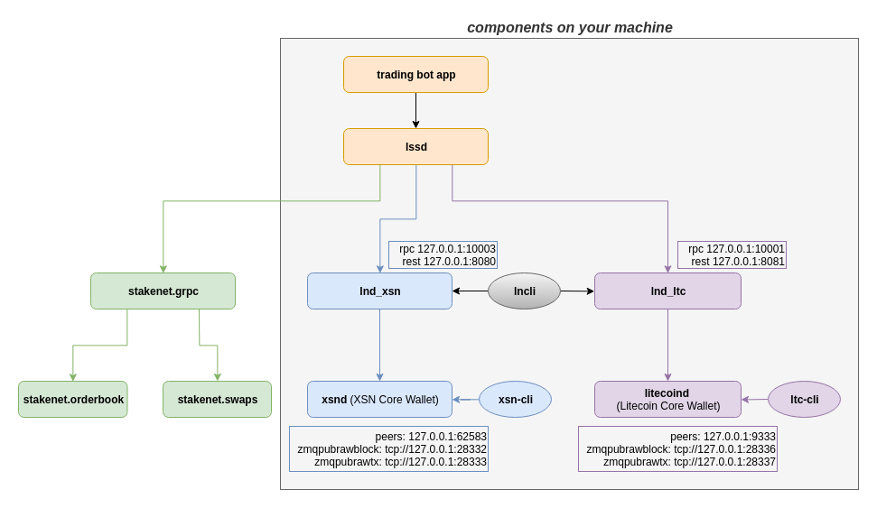

# DexAPI
The project has the nessesary components to create a bot for the [Stakenet Dex](http://orderbook.stakenet.io/).

# Components

* [trading-bot:](https://github.com/X9Developers/DexAPI/tree/master/trading-bot) a project built in scala, which is responsible for generating and placing orders to the orderbook, to make this, the bot has to connect with the lssd app by using its grpc api.  
Firstly it registers the currencies with which it will be working, after that it creates the trading_pair (you must use only the available ones from our [orderbook](http://orderbook.stakenet.io/)), then creates orders randomly, to both sides, Sell and Buy and send them to the lssd. You can see the docs [here](https://github.com/X9Developers/DexAPI/tree/master/trading-bot) 

* lssd: Light wallet Swap Service Daemon. Is a grpc application which is listening in `localhost: 50051`, is responsible for placing orders to the [Stakenet Dex](http://orderbook.stakenet.io/) and for making the swaps, to work the the lssd api needs to conect with [Lightning Network](https://lightning.network/) nodes to manage the wallets. 

    To understand the api, you have to read the proto file from [releases page](https://github.com/X9Developers/DexAPI/releases) in the lssd zip folder with the name of lssd.proto. 

    To run lssd: Download the app from [releases page](https://github.com/X9Developers/DexAPI/releases), take the last version

    Extract the zip file and open a terminal in `lssd/app/`.  then run `./lssd`. 

    To see if the api is working you can see the logs with:   

    `tail -f ~/.local/share/Stakenet/lssd/lssd.log`

    here you should see the [Stakenet Dex](http://orderbook.stakenet.io/) broadcasting some messages regularly.

* Custom lnds 
    They can be downloaded from [releases page](https://github.com/X9Developers/DexAPI/releases), take the last version 

    You must install the custom lnds in the next ports:
    * LTC: localhost:10001
    * BTC: localhost:10002
    * XSN: localhost:10003

    [How to configure custom LND](https://github.com/X9Developers/DexAPI/blob/lnd-conf/LNDCONFIGURATION.md)

## How it works

# Create your own Bot 

After running the services of lssd and lnd, these are the data we will need to create our own bot:

From lssd
* Ip
* Port

  From lnd:
* Ip
* Port:
* Tls cert:
 
To create the bot you need to follow the protobuf file (lssdrpc.proto) that comes within the lssd zip, in the app folder. which is downloaded from [releases page](https://github.com/X9Developers/DexAPI/releases), take the last version 

Step 1: Add the currencies (you must use only the available ones from our [Stakenet Dex](http://orderbook.stakenet.io/))

    // currencies
    service currencies {
        rpc AddCurrency (AddCurrencyRequest) returns (AddCurrencyResponse);
    }

Step 2 Then you must create the trading pair with:

    // trading pairs
    service tradingPairs {
        rpc EnableTradingPair (EnableTradingPairRequest) returns (EnableTradingPairResponse);
    }

Step 3: Place orders: 
We have to create the order request with:

    message PlaceOrderRequest {
        string pairId = 1;
        OrderSide side = 2;
        BigInteger funds = 3;
        BigInteger price = 4; // missing on market orders
    }

Step 4: Send the request to the lssd with:

    rpc PlaceOrder (PlaceOrderRequest) returns (PlaceOrderResponse);

Step 5: Waits until lssd daemon completes the swap, you can subscribe to swaps to know if swap is success or failure with: 

    // swaps
    service swaps {
        rpc SubscribeSwaps (SubscribeSwapsRequest) returns (stream SwapResult);
    }
      
